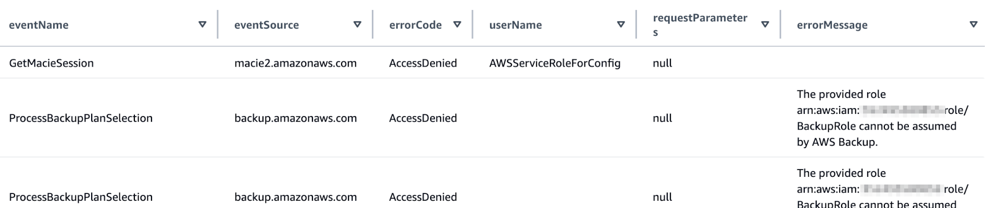
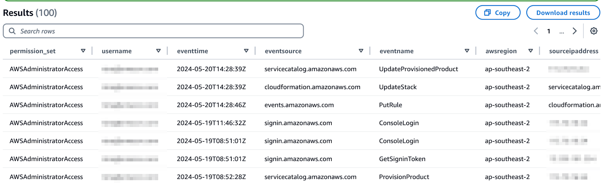
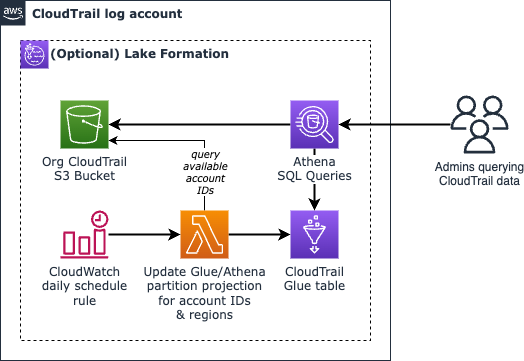

### Running SQL on AWS Organization AWS CloudTrail logs using partition projection

This template allows you to quickly run [Amazon Athena](https://aws.amazon.com/athena/) queries on an existing [AWS Organizations](https://aws.amazon.com/organizations/) [AWS CloudTrail](https://aws.amazon.com/cloudtrail/) log bucket or [AWS Control Tower](https://aws.amazon.com/controltower/) CloudTrail bucket, without any transformations or cleaning. It can work with read only access to the bucket, even from a different AWS account.

It uses [Athena's partition projection](https://docs.aws.amazon.com/athena/latest/ug/partition-projection.html), and has a scheduled (daily) [AWS Lambda](https://aws.amazon.com/lambda/) function to update the partitions with the list of AWS account IDs and regions. This way, queries limited to one or more accounts require considerably fewer Athena scans, and new accounts can be added via AWS Organizations or AWS Control Tower without having to manually update the partitions for CloudTrail log querying in new accounts to work.

_(For more optimized querying (by having the underlying log files in an optimized format for querying), consider using [Amazon Security Lake](https://aws.amazon.com/security-lake/) or [AWS CloudTrail Lake](https://docs.aws.amazon.com/awscloudtrail/latest/userguide/cloudtrail-lake.html) instead)_


## Installation

- Log into the account containing the Organization/Control Tower CloudTrail S3 bucket (or an AWS account that has access to the log S3 bucket via the bucket policy)

- Create a CloudFormation stack using the [cloudtrail-organization-athena.yaml](cloudtrail-organization-athena.yaml) template, with these parameters:

- - **OrganizationCloudTrailBucket**: The name of the Organization/Control Tower S3 bucket. For Control Tower, it will be in the format _aws-controltower-logs-<accountid>-<region>_
- - **AccountIdsBucketPrefix**: Bucket prefix containing list of account IDs, without the slash at the end. For Control Tower, use org-id/AWSLogs/org-id (for example, _o-abcd123/AWSLogs/o-abcd123_). For Organization trail, use org-id/AWSLogs (for example, _o-abcd1234/AWSLogs_)
- - **CloudTrailStartDate**: Approximate date in YYYY/MM/DD format of the first CloudTrail log entry, eg. 2024/01/01. Only events after this date will be queried.
- - **ConfigureLakeFormationGrants**: Optional, if you configured Lake Formation without legacy permissions, this is used to grant the Lambda function, and the role below, access to the table
- - **LakeFormationGrantRoleARN01**: Optional if ConfigureLakeFormationGrant is the default (No): the IAM role (eg. the AWS SSO permission set role) that should be granted access to the CloudTrail AWS Glue table via Lake Formation.

## Usage

- Go to Athena in the Management Console.
- Switch the Athena Workgroups (top bar), to **cloudtrail-logs**, and click on Acknowledge.
- On the cloudtrail table on the left, click on the 3 dot menu, and click on Preview. Alternatively, try running a query, making sure it's limited to a specific date range (eg. `eventdate >= '2024/05/15'`). See sample queries below.


## Sample queries:

Make sure all queries specify a range for `eventdate` to avoid scanning the entire bucket. See [Athena pricing](https://aws.amazon.com/athena/pricing/).

### Management console logins:

```sql
SELECT      useridentity.arn, sourceipaddress
FROM        cloudtrail
WHERE       eventname = 'ConsoleLogin'
AND         eventdate >= '2024/05/01'
AND         eventdate <= '2024/05/05'
-- Limit by account:
-- AND accountId = '01234567890'
GROUP BY    useridentity.arn, sourceipaddress
LIMIT 100
```

### Access denied messages

```sql
SELECT      eventDate, SPLIT_PART(eventTime, ':',1) as eventHours, region, accountId, eventName, eventSource, errorCode, userIdentity.sessionContext.sessionIssuer.userName, requestParameters, errorMessage 
FROM cloudtrail 
WHERE       eventdate >= '2024/06/09' 
AND         (errorcode = 'AccessDenied' 
OR          errorcode = 'Client.UnauthorizedOperation') 
AND awsregion = 'ap-southeast-2'
AND accountId = '01234567890'
```




### Actions by an IAM Identity Center permission set

This checks API calls by the AWSAdministratorAccess permission set for the given date range and account IDs. 

```sql
SELECT SPLIT_PART(useridentity.sessioncontext.sessionissuer.username,'_',2) as permission_set, SPLIT_PART(useridentity.principalid,':',2) as username, eventtime, eventsource, eventname, awsregion, sourceipaddress
FROM cloudtrail
WHERE accountid in ('0123456789', '23456789012')
AND eventdate >= '2024/05/01'
AND eventdate <= '2024/05/30'
AND useridentity.sessioncontext.sessionissuer.username LIKE 'AWSReservedSSO_AWSAdministratorAccess_%'
AND readonly = 'false'
limit 100
```



## Design



The number of partitions in a Organization or Control Tower CloudTrail S3 bucket can be large, as the partitions would contain every account ID, every region, year, month and day. Glue Crawlers have issues working with the CloudTrail structure, and even if it worked, since the number of partitions can be in the several thousands, the amount of time the crawler would take, and thus the cost, would increase over time.

This template makes use of a feature of Athena called Partition Projections. This allows the partition definition to be derived from the table configuration, rather than having every partition explicitly added to the Glue catalog. For more information, see:

[https://docs.aws.amazon.com/athena/latest/ug/partition-projection.html](https://docs.aws.amazon.com/athena/latest/ug/partition-projection.html])

The partitions projection that is configured are:

- **eventdate**: This will of type `date`, and using a CloudFormation parameter `CloudTrailStartDate`, should be set to approximately the date of the first CloudTrail log event. The partition projection will be configured from that start date to the current date (dynamic, using the value “NOW”). The format is yyyy/MM/dd.

- **accountid**: Normally, this needs to be set to the list (enum) of account IDs that have logs in the Control Tower CloudTrail bucket. This cannot be set to a large integer range, as Athena would have to scan every number in that range to see if there are valid folders during a query. It also cannot be set dynamically by Athena, as otherwise every SQL query on the CloudTrail logs would need to include the account IDs while querying. Thus, there is a Lambda function, which runs daily, that will get the list of account IDs in the CloudTrail bucket by listing the bucket contents in the folder containing the account IDs, and then updating the table projection properties for “accountid” to include the comma separated list of accountids. This allows Athena to know which folders to scan if the account ID was not specified in a query.

- **region**: Similar to the accountid, this is a list (enum) of region strings. This is also updated by the same Lambda function that updates the account IDs daily, to include all the known regions in the account hosting the log bucket. Make sure that this account opts into any regions used by other accounts.


## Security

See [CONTRIBUTING](CONTRIBUTING.md#security-issue-notifications) for more information.

## License

This library is licensed under the MIT-0 License. See the LICENSE file.
